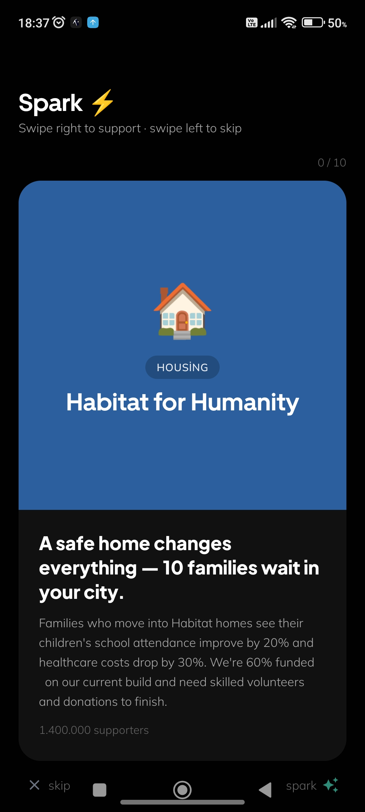

# Sparkle

A social media mobile app built with Expo (React Native), Supabase, and Redux Toolkit.

## Showcase

<p align="center">
  
  
  
</p>

## Features

- Posts with text and images
- Sparkle (like) and repost
- Nested comment threads
- Direct messages
- Profile with avatar upload
- Dark / light mode
- Google Sign-In + email/password auth with in-app password reset

## Tech Stack

| Layer      | Technology                           |
| ---------- | ------------------------------------ |
| Framework  | Expo SDK 54 (React Native 0.81)      |
| Navigation | Expo Router v4 (file-based)          |
| State      | Redux Toolkit                        |
| Backend    | Supabase (Postgres + Storage + Auth) |
| Language   | TypeScript                           |

## Getting Started

### Prerequisites

- Node.js 20+
- A Supabase project

### Environment variables

Create a `.env` file in the project root (never commit this file):

```
EXPO_PUBLIC_SUPABASE_URL=https://your-project.supabase.co
EXPO_PUBLIC_SUPABASE_ANON_KEY=your-anon-key
EXPO_PUBLIC_GOOGLE_WEB_CLIENT_ID=your-web-client-id.apps.googleusercontent.com
```

### Install and run

```bash
npm install
npx expo start
```

For a native build (required for Google Sign-In):

```bash
npx expo run:android
npx expo run:ios
```

### Database

Run `supabase/migration_v2.sql` in the Supabase SQL editor to set up the schema, RLS policies, and storage buckets.

## Project Structure

```
app/          # Expo Router screens
  (auth)/     # Sign-in and register
  (app)/      # Main app (tabs, post, profile, comment, DMs)
components/   # Reusable UI components
hooks/        # Custom React hooks
lib/          # Supabase client and API helpers
redux/        # Redux store and slices
supabase/     # SQL migrations
```

## License

MIT — see [LICENSE](LICENSE)
